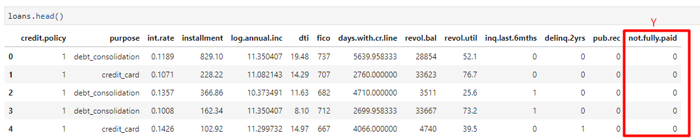

# Decision-Trees-and-Random-Forests

# DataFrames

EDA: Check out a simple pairplot for this dataset.

Train Test Split

Decision Trees: Start just by training a single decision tree.

Prediction and Evaluation

Tree Visualization: install the pydot library

Random Forests: Compare the decision tree model to a random forest.

Prediction and Evaluation

EDA: .hist  .countplot  .jointplot  .lmplot

Categorical Features:

Create a list of 1 element containing the string 'purpose'. Call this list cat_feats.

Now use pd.get_dummies(loans,columns=cat_feats,drop_first=True) to create a fixed larger dataframe that has new feature columns with dummy variables. Set this dataframe as final_data.

Train Test Split

Training a Decision Tree Model

Predictions and Evaluation of Decision Tree

Training the Random Forest model

Predictions and Evaluation of Random Forest
